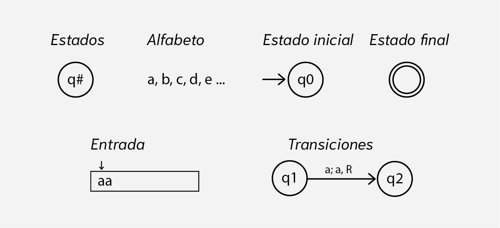
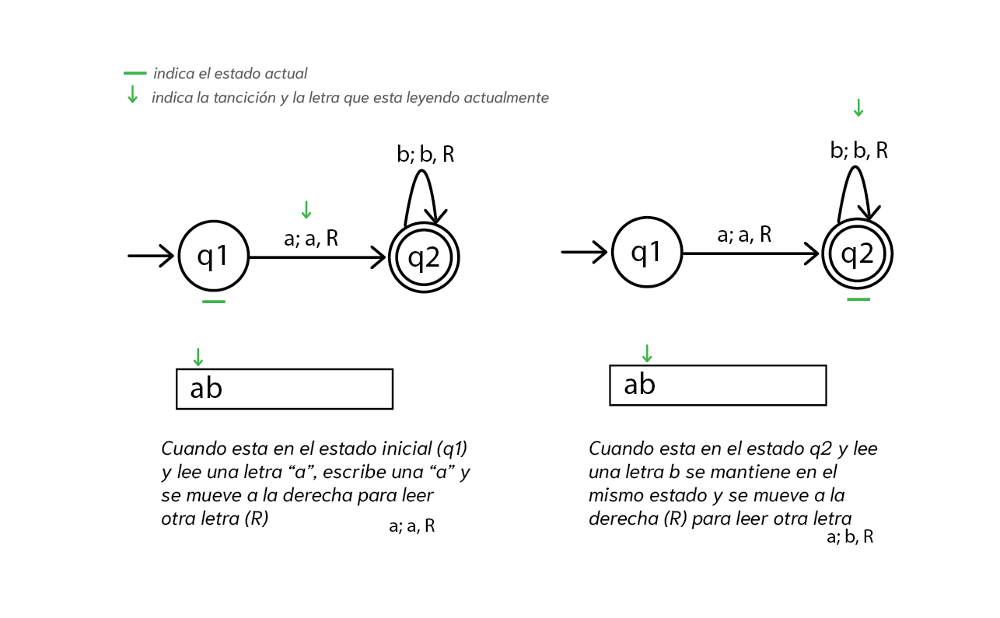
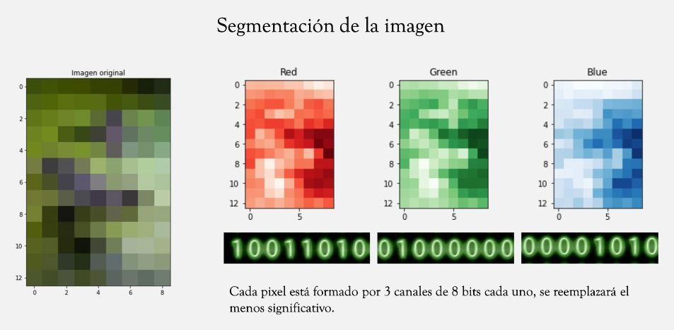
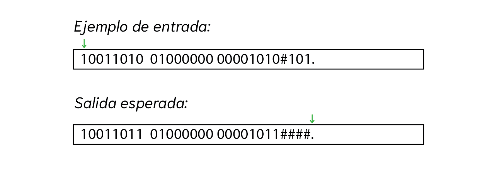
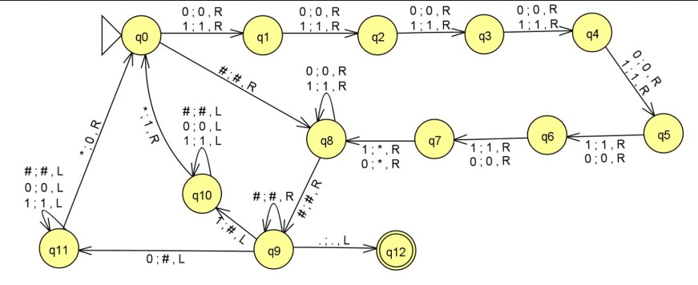
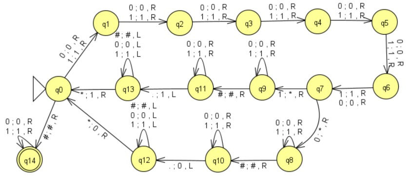
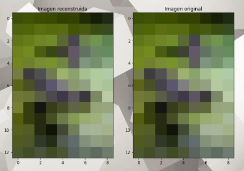

<!-- truncate -->

Últimamente, se ha visto un boom en la inteligencia artificial, impulsado por avances en el aprendizaje automático, el procesamiento del lenguaje natural y la capacidad de cómputo. Este crecimiento ha permitido el desarrollo de sistemas capaces de realizar tareas complejas como generar texto, reconocer imágenes, traducir idiomas y tomar decisiones en tiempo real. Detrás de estas capacidades se encuentran fundamentos teóricos sólidos, entre ellos los autómatas, que han sido clave para entender cómo las máquinas pueden procesar información de manera estructurada y eficiente.

## ¿Qué es un autómata?

Un autómata es un modelo que en su momento fue propuesto por **científicos como Alan Turing** y posteriormente formalizado por matemáticos como **Noam Chomsky**, con el objetivo de entender cómo las máquinas pueden **procesar información y resolver problemas de forma automática**. Estos modelos son la base de la teoría de lenguajes formales y la computación.

Las partes básicas de un autómata son las siguientes:

+ **Estados**: Tiene un conjunto finito de estados posibles.
+ **Alfabeto**: Un conjunto finito de símbolos que puede leer (la entrada).
+ **Estado inicial**: Un estado desde donde comienza.
+ **Estados finales**: Uno o varios estados que indican aceptación.
+ **Transiciones**: Reglas que indican cómo cambiar de un estado a otro según el símbolo leído (escribir algo, mover a izquierda o derecha).
+ **Entrada**: Cadena de símbolos del alfabeto que el autómata debe procesar (en teoría infinita, después de los símbolos de entrada).

Estas reglas definen cómo el autómata lee una entrada **símbolo por símbolo** de la entrada y decide si la acepta o la rechaza (también puede modificar la cadena). Si no se llega a un estado final, significa que la entrada no es aceptada por el autómata. Es decir, el autómata rechaza la cadena porque no cumple las reglas definidas para ser válida. Lo anterior, de igual forma que un programa arroja un error o no funciona correctamente si la entrada no es la indicada.
A continuación, un ejemplo de autómata. 

## Esteganografia (ocultando mensajes en objetos comunes, en este caso imágenes)

Vamos a hacer un ejemplo un poco más complejo e ilustrativo de un autómata que oculta un mensaje en una imagen de baja resolución 
Cabe destacar que hay algunas limitaciones debido a la librería de la que se hizo uso para realizar el automata.
En caso de querer implementarlo de una forma más eficiente y rápida, es recomendable usar un lenguaje de programación que permita manipular bits de manera directa

Las imágenes digitales que podemos ver a través de una pantalla están conformadas por píxeles, cada uno de estos contiene tres valores que reflejan la intensidad de los colores **rojo, verde y azul** (tenemos en nuestros ojos células sensibles a esos tres colores y nos permiten interpretar lo que vemos).
Cada canal (color) de un pixel está conformado por 8bits (0s y 1s, que podemos ver en la parte inferior) que almacenan un valor de intensidad de **0 a 255** representado en binario, el último número en binario (el que usaremos para ocultar el mensaje) solo representa un cambio de 1 en intensidad con lo cual es casi imperceptible para el ojo humano detectar la diferencia, ya que es un cambio aproximado del **0.4%** en un pixel. Para este ejemplo, separaremos la imagen de prueba en sus tres canales, como se puede ver en la imagen: 

### Definición del autómata:

El alfabeto del automata sera: 0, 1, *, #, . 

Donde el "**\***" y el "**#**" los usaremos como marcas para saber en dónde intercambiar los valores por los del mensaje; El "**.**" indicará el fin de la entrada.

El automata encargado de esconder el mensaje dentro de la imagen es el siguiente:

Iniciamos en el estado **q0**, después nos movemos a la derecha hasta que lleguemos al octavo bit **q7** (el menos significativo) y agregamos una marca para saber a dónde volver **(*)**. En el estado **q9** nos movemos hasta donde empieza el mensaje (después del último **#**), tomamos el primer carácter que encontramos del mensaje y nos lo llevamos a dodne habiamos dejado la primera marca (*); después repetimos el mismo procedimiento hasta que llegamos al carácter final **(".")**

Por otra parte, él automata encargado de decodificar la información oculta hará la operación inversa:

Como prueba de que es un cambio imperceptible, la siguiente imagen nos mostrará tanto la versión original como la que tiene el mensaje oculto dentro de sus píxeles:

## Conclusiones

Los autómatas no solo son una base fundamental en la teoría de la computación, sino que también tienen aplicaciones prácticas en áreas modernas como la inteligencia artificial, donde el procesamiento secuencial y estructurado de datos sigue siendo esencial.

¿Un reto podrán recuperar el mensaje que se encuentra en la última imagen? (*una pista, solo se modificó uno de los canales de color*).